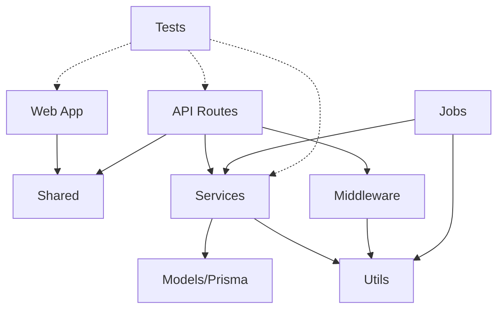

# Component Relationships

## 1. Overview

9 components identified via import analysis. Monorepo with clear app boundaries (web, api) sharing code through packages/shared. Backend follows a layered pattern (routes -> services -> models). Frontend uses Next.js App Router with component-based organization.

## 2. Component Catalog

### CM-001: Web App (Frontend)

| Field | Value |
|-------|-------|
| **Path** | `apps/web/src/` |
| **Type** | service |
| **Responsibility** | Next.js frontend: pages, components, client state |
| **Internal Dependencies** | CM-009 (Shared) |
| **External Dependencies** | next, react, zustand, tailwindcss |
| **Dependents** | — |
| **API Surface** | Route handlers: `app/api/{auth,products,orders,...}/route.ts` (BFF layer) |
| **Patterns Detected** | Component composition, App Router conventions |

### CM-002: API Routes

| Field | Value |
|-------|-------|
| **Path** | `apps/api/src/routes/` |
| **Type** | handler |
| **Responsibility** | HTTP endpoint definitions, request validation, response formatting |
| **Internal Dependencies** | CM-003 (Services), CM-005 (Middleware), CM-009 (Shared) |
| **External Dependencies** | express, zod |
| **Dependents** | — |
| **API Surface** | REST: `/api/auth/*`, `/api/products/*`, `/api/orders/*`, `/api/users/*`, `/api/payments/*` |
| **Patterns Detected** | Router pattern, input validation middleware |

### CM-003: Services

| Field | Value |
|-------|-------|
| **Path** | `apps/api/src/services/` |
| **Type** | service |
| **Responsibility** | Business logic: auth flows, order processing, payment integration |
| **Internal Dependencies** | CM-004 (Models), CM-007 (Utils) |
| **External Dependencies** | stripe, nodemailer |
| **Dependents** | CM-002 (Routes), CM-006 (Jobs) |
| **API Surface** | — |
| **Patterns Detected** | Service layer, dependency injection (constructor) |

### CM-004: Models (Prisma)

| Field | Value |
|-------|-------|
| **Path** | `apps/api/src/models/` + `prisma/` |
| **Type** | model |
| **Responsibility** | Data access via Prisma, database schema, migrations |
| **Internal Dependencies** | — |
| **External Dependencies** | @prisma/client |
| **Dependents** | CM-003 (Services) |
| **API Surface** | — |
| **Patterns Detected** | Repository (Prisma client wraps DB access) |

### CM-005: Middleware

| Field | Value |
|-------|-------|
| **Path** | `apps/api/src/middleware/` |
| **Type** | library |
| **Responsibility** | Auth verification, request validation, rate limiting, error handling |
| **Internal Dependencies** | CM-007 (Utils) |
| **External Dependencies** | jsonwebtoken, express-rate-limit |
| **Dependents** | CM-002 (Routes) |
| **API Surface** | — |
| **Patterns Detected** | Middleware chain, guard pattern |

### CM-006: Background Jobs

| Field | Value |
|-------|-------|
| **Path** | `apps/api/src/jobs/` |
| **Type** | service |
| **Responsibility** | Async processing: order fulfillment, email sending, inventory sync |
| **Internal Dependencies** | CM-003 (Services), CM-007 (Utils) |
| **External Dependencies** | bull |
| **Dependents** | — |
| **API Surface** | Bull queue consumers: `orderProcessor`, `emailSender`, `inventorySync` |
| **Patterns Detected** | Queue consumer, worker pattern |

### CM-007: Utils

| Field | Value |
|-------|-------|
| **Path** | `apps/api/src/utils/` |
| **Type** | util |
| **Responsibility** | Logger, crypto helpers, pagination |
| **Internal Dependencies** | — |
| **External Dependencies** | winston |
| **Dependents** | CM-003, CM-005, CM-006 |

### CM-008: Tests

| Field | Value |
|-------|-------|
| **Path** | `apps/api/src/**/*.test.ts`, `apps/web/src/**/*.test.tsx` |
| **Type** | test |
| **Responsibility** | Unit and integration tests |
| **Internal Dependencies** | CM-002, CM-003, CM-001 |
| **External Dependencies** | jest, supertest, @testing-library/react |

### CM-009: Shared Package

| Field | Value |
|-------|-------|
| **Path** | `packages/shared/src/` |
| **Type** | library |
| **Responsibility** | Cross-app types, Zod validators, constants |
| **Internal Dependencies** | — |
| **External Dependencies** | zod |
| **Dependents** | CM-001 (Web), CM-002 (Routes) |
| **Patterns Detected** | Shared kernel |

## 3. Dependency Graph

## 4. API Surfaces

| Component | Type | Endpoint / Interface | Method | Description |
|-----------|------|---------------------|--------|-------------|
| CM-002 | HTTP | `/api/auth/login` | POST | User authentication |
| CM-002 | HTTP | `/api/auth/register` | POST | User registration |
| CM-002 | HTTP | `/api/products` | GET, POST | Product listing and creation |
| CM-002 | HTTP | `/api/products/:id` | GET, PUT, DELETE | Single product CRUD |
| CM-002 | HTTP | `/api/orders` | GET, POST | Order listing and placement |
| CM-002 | HTTP | `/api/orders/:id` | GET, PUT | Order details and status update |
| CM-002 | HTTP | `/api/payments/webhook` | POST | Stripe webhook handler |
| CM-006 | Queue | `order-processing` | — | Async order fulfillment |
| CM-006 | Queue | `email-sending` | — | Async email delivery |

## 5. Circular Dependencies

None detected.

## 6. Cross-Cutting Concerns

| Concern | Implementation | Components Affected |
|---------|---------------|-------------------|
| Authentication | JWT middleware (`middleware/auth.ts`) | CM-002 (all protected routes) |
| Validation | Zod schemas via middleware | CM-002, CM-009 |
| Rate limiting | express-rate-limit middleware | CM-002 |
| Error handling | Centralized error middleware | CM-002 |
| Logging | Winston logger utility | CM-003, CM-005, CM-006, CM-007 |
