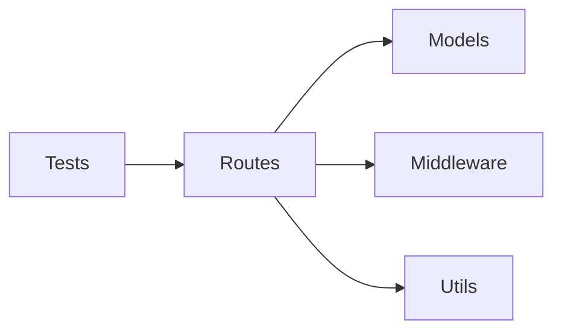

# Component Relationships

## 1. Overview

5 components identified via directory-based classification (lite mode — import analysis skipped).

## 2. Component Catalog

### CM-001: Routes

| Field | Value |
|-------|-------|
| **Path** | `src/routes/` |
| **Type** | handler |
| **Responsibility** | HTTP endpoint definitions for todos and health check |
| **External Dependencies** | express |

### CM-002: Models

| Field | Value |
|-------|-------|
| **Path** | `src/models/` |
| **Type** | model |
| **Responsibility** | Data structures and database access for Todo entity |
| **External Dependencies** | better-sqlite3 |

### CM-003: Middleware

| Field | Value |
|-------|-------|
| **Path** | `src/middleware/` |
| **Type** | library |
| **Responsibility** | Request pipeline: authentication and error handling |
| **External Dependencies** | — |

### CM-004: Utils

| Field | Value |
|-------|-------|
| **Path** | `src/utils/` |
| **Type** | util |
| **Responsibility** | Logger utility |
| **External Dependencies** | — |

### CM-005: Tests

| Field | Value |
|-------|-------|
| **Path** | `tests/` |
| **Type** | test |
| **Responsibility** | Unit and integration tests for routes |
| **External Dependencies** | jest, supertest |

## 3. Dependency Graph

*Lite mode — dependency graph based on directory structure, not import analysis.*

## 4. API Surfaces

| Component | Type | Endpoint / Interface | Method | Description |
|-----------|------|---------------------|--------|-------------|
| CM-001 | HTTP | `/api/todos` | GET, POST | List and create todos |
| CM-001 | HTTP | `/api/todos/:id` | GET, PUT, DELETE | CRUD for single todo |
| CM-001 | HTTP | `/health` | GET | Health check |

## 5. Circular Dependencies

None detected.

## 6. Cross-Cutting Concerns

*Lite mode — detailed cross-cutting analysis skipped.*

| Concern | Implementation | Components Affected |
|---------|---------------|-------------------|
| Authentication | `src/middleware/auth.ts` | CM-001 |
| Error handling | `src/middleware/errorHandler.ts` | CM-001 |
