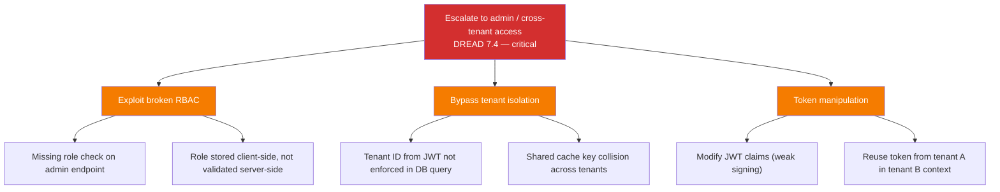

# SEC-TM-001 — Threat Model (E-Commerce Platform, heavy mode)

**Phase**: approved · **Mode**: heavy

## Mode and Scope

Heavy mode: 8 components, inter-service communication (gRPC + AMQP), 4 external interfaces, PII and payment data, GDPR and PCI DSS regulatory constraints. Full STRIDE with DREAD scoring applied.

## Trust Boundaries

| Boundary ID | Name | From | To | Classification |
|-------------|------|------|----|----------------|
| TB-001 | Internet boundary | End users (internet) | ARCH-COMP-001-gw | untrusted → DMZ |
| TB-002 | Gateway-to-services | ARCH-COMP-001-gw | internal service mesh | DMZ → trusted internal |
| TB-003 | Service-to-database | Each service | Its respective store | trusted → data store |
| TB-004 | Service-to-service | Order/Payment/Auth | gRPC inter-service | trusted → trusted (lateral) |
| TB-005 | External provider boundary | ARCH-COMP-001-payment | external:stripe | trusted → external provider |
| TB-006 | Webhook ingress | external:stripe | ARCH-COMP-001-payment /callbacks | untrusted → trusted |
| TB-007 | Notification egress | ARCH-COMP-001-notif | external:sendgrid, external:twilio | trusted → external provider |
| TB-008 | Message broker boundary | Services | RabbitMQ | trusted → async channel |

## Data Flow Security Classifications

| Flow ID | From | To | Data | Sensitivity | Encryption | Compliance |
|---------|------|----|------|-------------|------------|------------|
| DF-001 | User | API Gateway | Credentials, PII | high | TLS 1.3 | GDPR Art. 32 |
| DF-002 | Auth Service | Auth DB | Password hashes, user profiles | high | TLS + AES-256-at-rest | GDPR Art. 32 |
| DF-003 | Order Service | Order DB | Orders with PII (name, address) | high | TLS + AES-256-at-rest | GDPR Art. 32 |
| DF-004 | Payment Service | Stripe | Tokenised payment requests | critical | TLS 1.2+ (Stripe requirement) | PCI DSS 4.1 |
| DF-005 | Payment Service | Pay DB | Stripe tokens, transaction records | critical | TLS + AES-256-at-rest | PCI DSS 3.4 |
| DF-006 | Inter-service gRPC | Service mesh | Auth tokens, order IDs | medium | mTLS required | — |
| DF-007 | RabbitMQ | Notification Service | Event payloads (may contain PII) | high | TLS + message-level encryption | GDPR Art. 32 |

## STRIDE Analysis

### Spoofing

| Threat ID | Target | Description | DREAD Score | Risk |
|-----------|--------|-------------|-------------|------|
| TM-001 | TB-001 | Attacker steals JWT and impersonates a user; token theft via XSS or network sniffing | D:8 R:7 E:6 A:9 D:7 = **7.4** | high |
| TM-002 | TB-006 | Attacker sends forged Stripe webhook to trigger false payment confirmations | D:9 R:5 E:4 A:8 D:5 = **6.2** | high |
| TM-003 | TB-004 | Compromised service spoofs gRPC calls without mTLS, accessing other services' data | D:9 R:6 E:5 A:9 D:4 = **6.6** | high |

### Tampering

| Threat ID | Target | Description | DREAD Score | Risk |
|-----------|--------|-------------|-------------|------|
| TM-004 | DF-003 | SQL injection in order search modifies order records or exfiltrates PII | D:9 R:7 E:6 A:8 D:6 = **7.2** | high |
| TM-005 | TB-008 | Malicious message injected into RabbitMQ triggers unintended order state transitions | D:7 R:4 E:3 A:6 D:3 = **4.6** | medium |

### Repudiation

| Threat ID | Target | Description | DREAD Score | Risk |
|-----------|--------|-------------|-------------|------|
| TM-006 | Payment Service | User disputes a payment; insufficient audit trail to prove transaction was authorised | D:7 R:6 E:8 A:5 D:6 = **6.4** | medium |

### Information Disclosure

| Threat ID | Target | Description | DREAD Score | Risk |
|-----------|--------|-------------|-------------|------|
| TM-007 | DF-001 | PII leaked in API error responses (stack traces containing user data) | D:7 R:8 E:7 A:8 D:8 = **7.6** | high |
| TM-008 | DF-007 | PII in RabbitMQ messages readable if broker TLS is misconfigured | D:8 R:5 E:4 A:7 D:4 = **5.6** | medium |
| TM-009 | TB-003 | Database backup or log files contain unencrypted PII | D:8 R:6 E:5 A:9 D:5 = **6.6** | high |

### Denial of Service

| Threat ID | Target | Description | DREAD Score | Risk |
|-----------|--------|-------------|-------------|------|
| TM-010 | TB-001 | Volumetric attack on API Gateway exhausts resources, breaching 99.95% SLO | D:7 R:8 E:8 A:9 D:8 = **8.0** | high |
| TM-011 | TB-008 | RabbitMQ queue flooding stalls order processing and notifications | D:6 R:5 E:4 A:7 D:4 = **5.2** | medium |

### Elevation of Privilege

| Threat ID | Target | Description | DREAD Score | Risk |
|-----------|--------|-------------|-------------|------|
| TM-012 | Auth Service | Broken access control allows regular user to access admin endpoints or other tenants' data | D:9 R:7 E:6 A:9 D:6 = **7.4** | critical |
| TM-013 | Order Service | IDOR vulnerability allows user A to view/modify user B's orders | D:8 R:8 E:7 A:8 D:7 = **7.6** | high |

## Mitigation Strategies

| Threat ID | Strategy | Mitigation | Status |
|-----------|----------|------------|--------|
| TM-001 | mitigate | Short-lived JWTs (15 min), refresh token rotation, HttpOnly/Secure cookie flags, CSP headers | proposed |
| TM-002 | mitigate | Verify Stripe webhook signature (`stripe-signature` header) against webhook secret | proposed |
| TM-003 | mitigate | Enforce mTLS across service mesh (Istio/Linkerd), reject plaintext gRPC | proposed |
| TM-004 | mitigate | Parameterised queries via SQLAlchemy ORM exclusively; no raw SQL | proposed |
| TM-005 | mitigate | Message schema validation at consumer, dead-letter queue for malformed messages | proposed |
| TM-006 | mitigate | Immutable audit log for all payment state transitions with timestamps and actor IDs | proposed |
| TM-007 | mitigate | Structured error responses with error codes only; PII scrubbed from logs | proposed |
| TM-008 | mitigate | TLS for RabbitMQ connections, message-level encryption for PII fields | proposed |
| TM-009 | mitigate | Encrypted backups, log redaction pipeline, access controls on backup storage | proposed |
| TM-010 | mitigate | Kong rate limiting (per-IP and per-user), WAF rules, auto-scaling policies | proposed |
| TM-011 | mitigate | Queue depth limits, consumer back-pressure, priority queues for critical messages | proposed |
| TM-012 | mitigate | RBAC middleware in auth service, tenant isolation at DB query level, admin endpoints on separate port | proposed |
| TM-013 | mitigate | Ownership validation in repository layer, integration tests for IDOR scenarios | proposed |

## Attack Tree — Top Threat (TM-012: Privilege Escalation)

## Upstream Refs

- ARCH-COMP-001, ARCH-DEC-001, ARCH-DEC-002, ARCH-TECH-001, ARCH-DIAG-001
- IMPL-MAP-001 through IMPL-MAP-005, IMPL-CODE-001, IMPL-IDR-001, IMPL-GUIDE-001
- RE-CON-001, RE-CON-002, RE-CON-003, RE-QA-001, RE-QA-002
