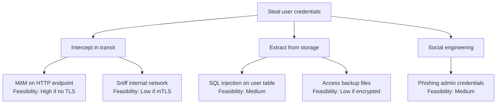

# Workflow — Stage 1: Threat Modeling Stage — Detailed Rules

## Role

Derive trust boundaries and attack surfaces from approved Arch artifacts, conduct STRIDE analysis through structured dialogue with the user, produce DREAD-scored threats with mitigation strategies, and generate attack trees for high-risk threats. This is the only stage that requires user dialogue — all domain context (data sensitivity, threat actors, regulatory scope) must be confirmed before STRIDE analysis begins.

## Inputs

### Arch artifact consumption

- **`ARCH-COMP-*.component_structure.type`** — Trust boundary derivation:
  - `gateway` → external trust boundary (internet-facing, untrusted input)
  - `store` → data trust boundary (persistence layer, encryption-at-rest surface)
  - `queue` → async trust boundary (message integrity, replay attack surface)
  - `service` → internal trust boundary (inter-service auth, lateral movement surface)
  - Each type change between connected components marks a trust boundary crossing.

- **`ARCH-COMP-*.component_structure.interfaces`** — Attack surface catalog:
  - Every exposed interface (HTTP endpoint, gRPC method, WebSocket channel, CLI command) is one attack surface entry.
  - Record: protocol, authentication requirement (from Arch or inferred), data exchanged, public vs. internal.

- **`ARCH-COMP-*.component_structure.dependencies`** — Data flow paths and privilege propagation:
  - Walk the dependency graph to trace data flows from entry point to storage.
  - Each edge is a data flow; annotate with: data classification (from user dialogue), transport encryption, authentication at the boundary.
  - Privilege propagation: if component A calls component B with A's credentials, B inherits A's privilege scope — flag this for elevation-of-privilege analysis.

- **`ARCH-DIAG-*.diagrams` (type: c4-container)** — DFD base:
  - Use the C4 container diagram as the starting point for the Data Flow Diagram.
  - Overlay trust boundaries derived from component types.
  - Every arrow crossing a trust boundary is a candidate for STRIDE analysis.

- **`ARCH-DIAG-*.diagrams` (type: sequence)** — Auth/authz verification points:
  - Each sequence diagram call that crosses a trust boundary must show an authentication step.
  - If the sequence diagram lacks an auth step at a trust boundary crossing, record it as a potential Spoofing or Elevation of Privilege threat.

- **`ARCH-DEC-*.architecture_decisions.decision`** — Security implications:
  - Read each ADR's `decision` and `trade_offs`. Extract security implications.
  - Example: "chose REST over gRPC for public API" → implies need for rate limiting, input validation at the HTTP layer, CORS configuration.
  - Example: "chose eventual consistency" → implies need for idempotency tokens, replay protection.

### RE artifact consumption (indirect)

- RE artifacts are consumed through Arch's `re_refs` and `constraint_ref` chains.
- `constraint_ref` entries with `type: regulatory` determine the regulatory scope (feeds into Stage 4 but must be identified here for threat actor profiling).
- `constraint_ref` entries with `type: security` are direct security requirements that must appear as mitigations.

## Domain context dialogue

After reading all Arch and Impl artifacts, engage the user in a structured dialogue to surface context that artifacts alone cannot provide. Ask about each topic below. Do not proceed to STRIDE analysis until answers are confirmed.

### Data sensitivity classification

Ask the user to classify the data handled by each component:

| Classification | Examples | Impact if breached |
|---|---|---|
| **PII** | Name, email, phone, address, SSN | Regulatory (GDPR/CCPA), reputational |
| **PHI** | Medical records, diagnoses, prescriptions | HIPAA violations, legal liability |
| **Financial** | Credit card numbers, bank accounts, transactions | PCI DSS scope, fraud liability |
| **Authentication** | Passwords, tokens, API keys, certificates | Full system compromise |
| **Public** | Marketing content, public API docs | Minimal direct impact |

Map each classification to the components and data flows that handle it.

### User roles and permissions

Ask the user to enumerate:

- All user roles (e.g. anonymous, authenticated, admin, super-admin, service-account).
- Permission boundaries between roles.
- Which interfaces each role can access.
- Whether privilege escalation paths exist by design (e.g. admin can impersonate user).

### External system trust levels

For each external dependency in the Arch artifacts:

- Is it fully trusted (e.g. internal corporate service with mutual TLS)?
- Is it partially trusted (e.g. third-party SaaS with contractual SLA)?
- Is it untrusted (e.g. user-supplied webhooks, public internet)?

### Regulatory scope

Confirm which regulations apply. Derive initial candidates from RE constraints, then ask the user to confirm or add:

- GDPR (EU personal data)
- HIPAA (US health data)
- PCI DSS (payment card data)
- SOC 2 (service organization controls)
- Other industry-specific standards

### Threat actor profiles

Ask the user which threat actors are in scope:

| Actor | Capability | Motivation | Typical attacks |
|---|---|---|---|
| **Script kiddie** | Low skill, automated tools | Opportunistic | Known CVEs, default credentials, SQLi scanners |
| **Disgruntled insider** | System access, domain knowledge | Revenge, financial gain | Data exfiltration, privilege abuse, sabotage |
| **Organized crime** | Moderate skill, persistent | Financial | Ransomware, credential stuffing, fraud |
| **Competitor** | Moderate skill, targeted | Competitive advantage | IP theft, service disruption |
| **Nation-state** | High skill, persistent, resourced | Espionage, disruption | APT, supply chain, zero-day exploitation |

Default to "script kiddie + disgruntled insider" if the user has no specific threat model. Adjust DREAD scoring accordingly.

## STRIDE methodology

Apply STRIDE to every component, data flow, and trust boundary crossing identified above. For each element, systematically evaluate all six categories:

| Category | Question | Example threats |
|---|---|---|
| **Spoofing** | Can an attacker pretend to be another user, component, or system? | Forged JWT, session hijacking, DNS spoofing, certificate impersonation |
| **Tampering** | Can an attacker modify data in transit or at rest? | Man-in-the-middle, SQL injection modifying records, unsigned message alteration |
| **Repudiation** | Can an actor deny performing an action? | Missing audit logs, unsigned transactions, no request correlation IDs |
| **Information Disclosure** | Can an attacker access data they should not see? | Verbose error messages, directory traversal, insecure direct object references |
| **Denial of Service** | Can an attacker degrade or prevent service? | Resource exhaustion, algorithmic complexity attacks, lock-out via brute force |
| **Elevation of Privilege** | Can an attacker gain higher access than intended? | Broken access control, insecure deserialization to RCE, privilege escalation via dependency |

### STRIDE application rules

1. Trust boundary crossings get all six STRIDE categories evaluated.
2. Internal data flows (within one trust boundary) get Tampering, Information Disclosure, and Denial of Service.
3. Data stores get Tampering, Information Disclosure, and Repudiation.
4. External entities get Spoofing and Repudiation.
5. Each identified threat gets a unique ID: `TM-001`, `TM-002`, etc.
6. Each threat must reference the Arch component (`arch_refs`) it applies to.

## DREAD scoring

Score every identified threat on five dimensions, each 1-10:

| Dimension | 1 (Low) | 5 (Medium) | 10 (High) |
|---|---|---|---|
| **Damage** | Minor inconvenience | Significant data loss | Complete system compromise |
| **Reproducibility** | Requires rare conditions | Reproducible with effort | Trivially reproducible every time |
| **Exploitability** | Requires nation-state capability | Requires moderate skill and tools | Automated exploit available |
| **Affected Users** | Single user, edge case | Subset of users | All users |
| **Discoverability** | Requires source code access and deep expertise | Findable with targeted scanning | Publicly known or obvious |

**Total score** = sum of all five dimensions (range 5-50).

**Risk level mapping**:

| Total score | Risk level |
|---|---|
| 40-50 | `critical` |
| 30-39 | `high` |
| 20-29 | `medium` |
| 10-19 | `low` |
| 5-9 | `informational` |

Present the DREAD scores in a table to the user before finalizing.

## Mitigation strategies

For each identified threat, propose one of four mitigation strategies:

| Strategy | When to use | Example |
|---|---|---|
| **Mitigate** | Threat can be reduced to acceptable level by a control | Add JWT validation, implement rate limiting, encrypt data at rest |
| **Transfer** | Risk is better handled by another party | Use a managed auth provider (Auth0, Cognito), outsource PCI compliance to a payment processor |
| **Accept** | Residual risk is within tolerance after cost-benefit analysis | Low-impact information disclosure on a public-data endpoint |
| **Avoid** | Eliminate the feature or flow that creates the threat | Remove the admin-impersonation feature, disable XML parsing if not needed |

### Mitigation rules

- `critical` threats: must be mitigated or avoided. Accept and transfer require explicit user justification recorded via `sec-record approval.py accept-risk`.
- `high` threats: mitigate or transfer preferred. Accept requires user acknowledgement.
- `medium` and below: any strategy is acceptable with user confirmation.
- Every mitigation must be concrete and verifiable: "add input validation" is insufficient — specify "validate `user_id` parameter as UUID format using allowlist regex before database query".
- Present all mitigations to the user for confirmation before finalizing.

## Attack tree generation

For every threat with `risk_level: critical` or `risk_level: high`, generate an attack tree in Mermaid format. The tree shows:

- Root: the threat goal (e.g. "Steal user credentials")
- Children: attack methods (AND/OR decomposition)
- Leaves: specific techniques with feasibility notes

Example:



Attack trees help the user visualize the threat landscape and prioritize mitigations.

## Interaction model

The threat modeling stage follows this sequence:

1. **Auto-derive** — Read all Arch and Impl artifacts. Derive trust boundaries, attack surfaces, data flows, and auth verification points. Present the derived model to the user.
2. **Dialogue** — Ask the user about data sensitivity, user roles, external trust levels, regulatory scope, and threat actor profiles. Record all answers.
3. **STRIDE draft** — Apply STRIDE to all elements. Score with DREAD. Present the threat table to the user.
4. **User confirm threats** — User reviews, adjusts scores, adds/removes threats. Iterate until confirmed.
5. **Mitigation proposal** — Propose mitigations for each threat. Present to the user.
6. **User confirm mitigations** — User reviews, adjusts strategies, provides risk acceptance rationale where needed. Iterate until confirmed.
7. **Finalize** — Generate attack trees for high/critical threats. Compile the complete Threat Model section. Tell the user the exact `sec-record` commands to create the artifact.

Do not skip steps. Do not proceed from step 3 to step 5 without user confirmation of the threat table.

## Read-only reminder

Sec is read-only. This stage produces analysis text and recommendations only. All artifact creation and state changes must be delegated to `sec-record`. When the threat model is ready, provide the user with the exact commands:

```
sec-record: artifact.py init --section threat-model
# User edits SEC-TM-001.md with the threat model content
sec-record: artifact.py link SEC-TM-001 --upstream ARCH-COMP-001
sec-record: artifact.py link SEC-TM-001 --upstream ARCH-DEC-001
sec-record: artifact.py set-progress SEC-TM-001 --completed 7 --total 7
sec-record: artifact.py set-phase SEC-TM-001 in_review
```

Adjust the upstream links to include every Arch artifact referenced in the threat model.

## Escalation

Escalate to the user immediately (pause analysis) when:

- A threat scores `risk_level: critical` (DREAD total 40-50). The user must acknowledge and decide on mitigation before proceeding.
- An Arch artifact is missing or not yet `approved` — Sec must not analyse unstable input.
- A trust boundary crossing has no authentication mechanism in any Arch artifact — this is an architectural gap, not just a threat.
- The user's domain context reveals data sensitivity or regulatory scope that fundamentally changes the threat landscape (e.g. PHI data discovered in a system with no HIPAA controls).

Do **not** escalate for:

- Medium or low threats — record them and present in the summary.
- Uncertainty about threat actor capability — use the default profile and let the user adjust.
- Missing Impl details — Stage 2 (audit) handles code-level analysis.
